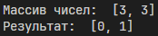

# Лабораторная работа 2. Сумма двух
## Постановка задачи
Дан массив целых чисел nums и целочисленное значение переменной target , верните индексы двух чисел таким образом, чтобы они в сумме давали target. У каждого входного набора может не быть решений и может быть только одно решение, если есть элементы дающие в сумме target. Вы не можете  использовать один и тот же элемент дважды (и соответственно индекс тоже). Вы можете вернуть ответ в любом порядке нахождения индексов.

Удостоверьтесь, что решение проходит следующие тесты: 


Example 1:

Input: nums = [2,7,11,15], target = 9

Output: [0,1]

Example 2:

Input: nums = [3,2,4], target = 6

Output: [1,2]

Example 3:

Input: nums = [3,3], target = 6

Output: [0,1]

## Код программы
```python
nums = [3, 3]
target = 6

def find_sum(nums, target):
    for i in range(len(nums) - 1):
        for j in range(i + 1, len(nums)): 
            if nums[i] + nums[j] == target:
                return [i, j]
    return 'Подходящей пары не найдено' 

print('Массив чисел: ', nums)
print('Результат: ', find_sum(nums, target))
```
## Результат

## Пояснение к коду
Создаем и записываем массив целых чисел **nums** и целое число **target**.

В функции **find_sum** используем внешний цикл **i** и внутренний цикл **j** для того, чтобы не использовать один и тот же элемент дважды.

Если сумма двух чисел будет равна заданному числу в переменной **target**, то будут возвращены их индексы.

## Тестирование

```python
import unittest
from sum import find_sum

class TestSum(unittest.TestCase):
    def test_example_1(self):
        nums = [2, 7, 11, 15]
        target = 9
        self.assertEqual(find_sum(nums, target), [0, 1])

    def test_example_2(self):
        nums = [3, 2, 4]
        target = 6
        self.assertEqual(find_sum(nums, target), [1, 2])

    def test_example_3(self):
        nums = [3, 3]
        target = 6
        self.assertEqual(find_sum(nums, target), [0, 1])

    def test_example_4(self):
        nums = [1, 2, 3, 4, 5, 6, 7, 8]
        target = 15
        self.assertEqual(find_sum(nums, target), [6, 7])

    def test_example_5(self):
        nums = [228, 322, 1337, 69, 52, 42, 67]
        target = 389
        self.assertEqual(find_sum(nums, target), [1, 6])
        
unittest.main(verbosity = 2)
```
## Результат тестирования


### Ефимов Сергей Робертович, 2 курс, ИВТ-2