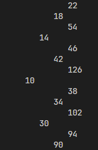
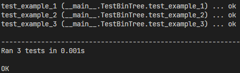

# Лабораторная работа 3. Построение бинарного дерева
## Постановка задачи
Напишите на языке Python рекурсивную функцию gen_bin_tree, которая будет строить бинарное дерево.

Алгоритм построения дерева должен учитывать параметры height, root, left_leaf и right_leaf, переданные в качестве аргументов функции.

Если для указанных параметров были переданы значения, то используются они.
В противном случае должны использоваться значения, указанные в варианте.
Базовый вариант решения задачи должен представлять результат в виде словаря с ключами value, left, right.

Построенное дерево должно обладать следующими свойствами:

1. В корне дерева (root) находится число, которое задает пользователь.
2. Высота дерева (height) задается пользователем.
3. Левый (left) и правый потомок (right) вычисляется с использованием алгоритмов (left_leaf и right_leaf).

Алгоритмы по умолчанию нужно задать с использованием lambda-функций.

Вариант условия 2:
root = 2, height = 6
left_leaf = root * 3
right_leaf = root + 4

## Код программы
### Обычный
```python
def gen_bin_tree(height = 2, root = 6, left_leaf = lambda x: x * 3, right_leaf = lambda x: x + 4):
    if height < 0:
        print('Высота дерева не может быть меньше нуля -_-')
        return None
    
    if height == 0:
        return {'root': root}
    
    if height > 0:
        dictionary_tree = {
            'root': root,
            'left': gen_bin_tree(height - 1, left_leaf(root), left_leaf, right_leaf),
            'right': gen_bin_tree(height - 1, right_leaf(root), left_leaf, right_leaf)
        }
        return dictionary_tree

def print_tree(tree, level=0):
    if not tree:
        return None
    
    if 'right' in tree:
        print_tree(tree['right'], level + 1)

    print("   " * level + str(tree['root']))

    if 'left' in tree:
        print_tree(tree['left'], level + 1)


```


## Результат


На изображении видно только часть результата, так как бинарное дерево слишком большое.

## Пояснение к коду
### Функция gen_bin_tree
Параметры:
- height - высота дерева
- root - корень дерева
- left_leaf - функция вычисления левой ветки
- right_leaf - функция вычисления правой ветки

Если высота дерева меньше нуля, то возвращается пустое значение.
Если высота дерева равна нулю, то возвращается корень дерева.
Если высота дерева больше нуля, то создается словарь, в котором рекурсивно строится дерево с вычислениями левого и правого потомков.

### Функция print_tree
Если дерево пустое, то возвращается пустое значение.

Сначала выводится правое поддерево. Дальше выводится корень дерева. И в последнюю очередь левое поддерево.


## Тестирование
```python
import unittest
from tree import gen_bin_tree

class TestBinTree(unittest.TestCase):
    def test_example_1(self):
        tree = gen_bin_tree(0, 9)
        self.assertEqual(tree['root'], 9)

    def test_example_2(self):
        tree = gen_bin_tree(1, 9)
        self.assertEqual(tree['root'], 9)
        self.assertIn('root', tree)
        self.assertIn('left', tree)
        self.assertIn('right', tree)
        
        
    def test_example_3(self):
        tree = gen_bin_tree(3, 3)
        self.assertEqual(tree['root'], 3) 
        self.assertIn('left', tree['left'])
        self.assertIn('left', tree['right'])
        self.assertIn('right', tree['left'])
        self.assertIn('right', tree['right'])
        self.assertIn('root', tree['left']['left'])
        self.assertIn('root', tree['left']['right'])
        self.assertIn('root', tree['right']['left'])
        self.assertIn('root', tree['right']['right'])
       
unittest.main(verbosity = 2)
```
## Результат

### Ефимов Сергей Робертович, 2 курс, ИВТ-2
