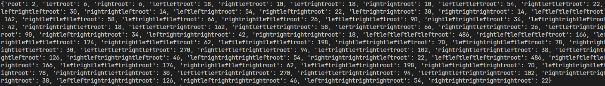
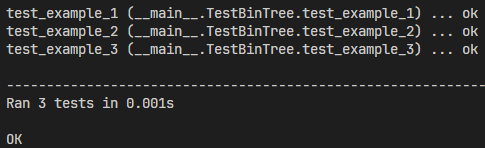

# Лабораторная работа 4. Построение бинарного дерева (без рекурсии)
## Постановка задачи
Разработайте программу на языке Python, которая будет строить бинарное дерево (дерево, в каждом узле которого может быть только два потомка). Отображение результата в виде словаря (как базовый вариант решения задания). Далее исследовать другие структуры, в том числе доступные в модуле collections в качестве контейнеров для хранения структуры бинарного дерева. 

Необходимо реализовать нерекурсивный вариант gen_bin_tree

Алгоритм построения дерева должен учитывать параметры, переданные в качестве аргументов функции. Пример: 
```python
def gen_bin_tree(height=<number>, root=<number>, left_branch=lambda l_r: l_r, right_branch=lambda r_r: r_r):

    pass
```
Если параметры были переданы, то используются они. В противном случае используются параметры, указанные в варианте.

Дерево должно обладать следующими свойствами:

1. В корне дерева (root) находится число, которое задает пользователь (индивидуально для студента).
2. Высота дерева (height) задается пользователем (индивидуально для студента).
3. Левый (left leaf) и правый потомок (right leaf) вычисляется с использованием алгоритмов, индивидуальных для каждого студента в группе и приведен ниже.
4. Если ваш номер в группе, больше чем последний номер в списке ниже, начинаете отсчет с начала (пример: если вы под №19, то ваш вариант условия №1)

Вариант условия 2: root = 2, height = 6, left_leaf = root * 3 right_leaf = root + 4
## Код программы
```python
from collections import deque

def gen_bin_tree(height=6, root=2, left=lambda l_r: l_r*3, right=lambda r_r: r_r+4):
    """
    Генерирует бинарное дерево в виде словаря.
    
    Аргументы:
        height: Высота дерева.
        root: Значение корневого узла.
        left: Функция для вычисления значения левого потомка.
        right: Функция для вычисления значения правого потомка.
    
    Возвращает:
        tree: Словарь, представляющий бинарное дерево. Ключ - путь к узлу, а значения - это значения узлов.
    """
    if height == 0:
        return {'root': root}
    
    tree = {'root': root}
    queue = deque([(root, 1, 'root')])
    
    while queue:
        value, lvl, path = queue.popleft()
        if lvl < height:
            left_value = left(value)
            right_value = right(value)
            tree[f'left{path}'] = left_value
            tree[f'right{path}'] = right_value
            queue.append((left_value, lvl+1, f'left{path}'))  
            queue.append((right_value, lvl+1, f'right{path}'))
    
    return tree
```
## Результат


## Пояснение к коду
### Аргументы функции gen_bin_tree
- height - высота дерева
- root - корень дерева
- left = lambda l_r: l_r * 3 - вычисление левой ветки
- right = lambda r_r: r_r + 4 - вычисление правой ветки
### Функция gen_bin_tree
Если высота равна 0, то возвращается корень.
Инициализируем словарь для хранения дерева **tree** и очередь для обхода **queue**.
#### Кортежи в очереди queue
- root - текущее значение
- 1 - текущий уровень
- 'root' - путь узла

Пока в queue есть значения для обработки, то извлекаем первый элемент. Если уровень дерева меньше максимальной высоты, тогда вычисляем левую и правую ветки дерева. После чего добавляем их в словарь **tree**, динамически создавая новые ключи, например, f'left{path}' создаст ключ leftroot. Также добавляем потомков в очередь **queue** для дальнейшей обработки.

## Тестирование
```python
import unittest
from tree import gen_bin_tree

class TestBinTree(unittest.TestCase):
  def test_example_1(self):
      tree = gen_bin_tree(height=0, root=9)
      self.assertEqual(tree, {'root': 9})

  def test_example_2(self):
      tree = gen_bin_tree(height=2, root=2)
      expectation = {
          'root': 2,
          'leftroot': 6,
          'rightroot': 6
      }
      self.assertEqual(tree, expectation)
      
  def test_example_3(self):
      tree = gen_bin_tree(height=3, root=3)
      expectation = {
          'root': 3,
          'leftroot': 9,
          'rightroot': 7,
          'leftleftroot': 27,
          'rightleftroot': 13,
          'leftrightroot': 21,
          'rightrightroot': 11
      }
      self.assertEqual(tree, expectation)
      
unittest.main(verbosity = 2)
						 
        
```
## Результат


### Ефимов Сергей Робертович, 2 курс, ИВТ-2