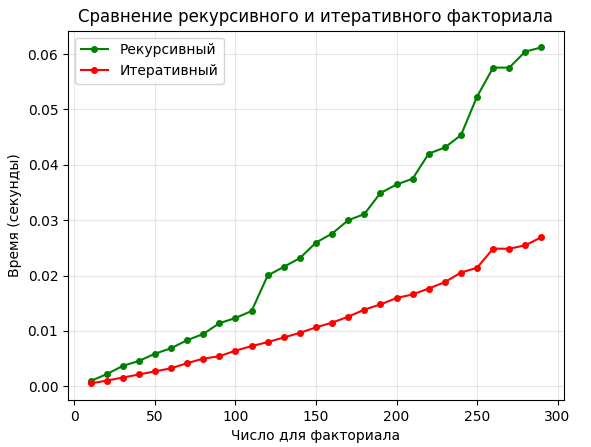
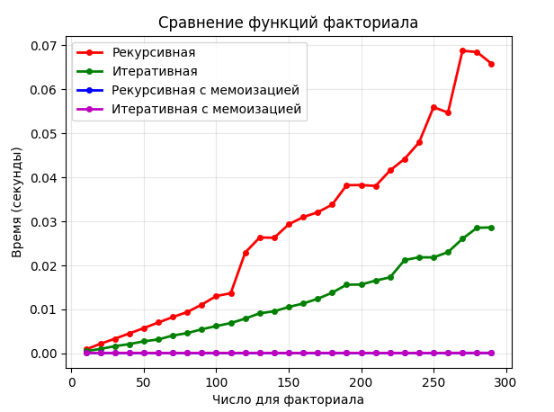
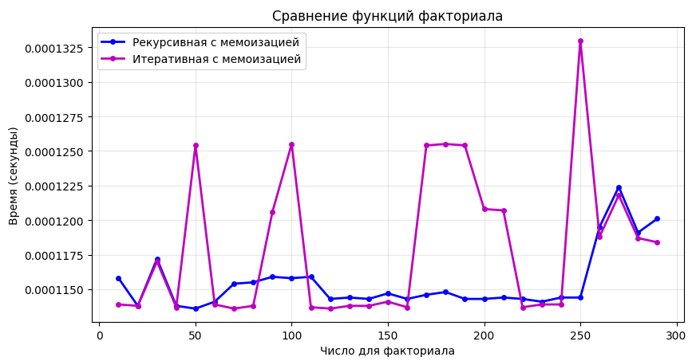

# Лабораторная работа 5. Сравнение функций. Мемоизация.
## Пояснение задачи
Сравните время работы двух реализаций функции вычисления факториала:
- рекурсивной
- нерекурсивной (через цикл).

Изучить материал про мемоизацию и реализовать сравнение мемоизованных и немемоизованных вариантов функций (рекурсивной и нерекурсивной). Проанализировать результаты и сделать выводы, описать выводы в отчете, построить графики.

Для сравнения используйте модуль timeit, а для наглядности постройте график с помощью matplotlib, показывающий зависимость времени выполнения от входных данных.

Условия:
- Реализуйте две функции fact_recursive(n) и fact_iterative(n).

- Для корректного сравнения используйте одинаковый набор чисел для тестирования.

- Визуализируйте результаты (ось X — размер входного числа n, ось Y — время вычислений).

- Сравните эффективность двух подходов.

Требования: 
- сгенерировать один фиксированный список чисел для всех прогонов и несколько раз запустить вычисления для усреднения.
- необходимо провести "чистый бенчмарк" одного вызова (для одного числа) / показать replit. 
## Код программы
### Сравнение рекурсивной и итеративной функции
```python
import timeit
import matplotlib.pyplot as plt

def fact_recursive(n):
    if n < 0:
        return 'Число не должно быть меньше нуля'
    if n == 0 or n == 1:
        return 1
    return n * fact_recursive(n - 1)

def fact_iterative(n):
    if n < 0:
        return 'Число не должно быть меньше нуля'
    result = 1
    for i in range(1, n + 1):
        result *= i
    return result

def benchmark(func, n, number=1, repeat=3):
    times = timeit.repeat(lambda: func(n), number=number, repeat=repeat)
    return min(times)


def main():
    n_list = list(range(10, 300, 10))
    
    result_recursive = []
    result_iterative = []

    for n in n_list:
        time_recursive = benchmark(fact_recursive, n, number=1000, repeat=3)
        time_iterative = benchmark(fact_iterative, n, number=1000, repeat=3)
        
        result_recursive.append(time_recursive)
        result_iterative.append(time_iterative)

    plt.plot(n_list, result_recursive, 'go-',  label="Рекурсивный", markersize=4)
    plt.plot(n_list, result_iterative, 'ro-',  label="Итеративный", markersize=4)
    plt.xlabel("Число для факториала")
    plt.ylabel("Время (секунды)")
    plt.title("Сравнение рекурсивного и итеративного факториала")
    plt.legend()
    plt.grid(True, alpha=0.3)
    plt.show()


if __name__ == "__main__":
    main()
```

### Сравнение рекурсивной и итеративной функции без мемоизации и с мемоизацией
```python
import timeit
import matplotlib.pyplot as plt
from functools import lru_cache

def fact_recursive(n):
    if n < 0:
        return 'Число не должно быть меньше нуля'
    if n == 0 or n == 1:
        return 1
    return n * fact_recursive(n - 1)

def fact_iterative(n):
    if n < 0:
        return 'Число не должно быть меньше нуля'
    result = 1
    for i in range(1, n + 1):
        result *= i
    return result

@lru_cache(maxsize=None)
def fact_recursive_memo(n):
    if n < 0:
        return 'Число не должно быть меньше нуля'
    if n == 0 or n == 1:
        return 1
    return n * fact_recursive_memo(n - 1)

@lru_cache(maxsize=None)
def fact_iterative_memo(n):
    if n < 0:
        return 'Число не должно быть меньше нуля'
    result = 1
    for i in range(1, n + 1):
        result *= i

    return result

def benchmark(func, n, number=1, repeat=5):
    times = timeit.repeat(lambda: func(n), number=number, repeat=repeat)
    return min(times)

def main():
    n_list = list(range(10, 300, 10))

    times_recursive = []
    times_iterative = []
    times_recursive_memo = []
    times_iterative_memo = []

    for n in n_list:
        time_recursive = benchmark(fact_recursive, n, repeat=5, number=1000)
        time_iterative = benchmark(fact_iterative, n, repeat=5, number=1000)
        time_recursive_memo = benchmark(fact_recursive_memo, n, repeat=5, number=1000)
        time_iterative_memo = benchmark(fact_iterative_memo, n, repeat=5,number=1000)

        times_recursive.append(time_recursive)
        times_iterative.append(time_iterative)
        times_recursive_memo.append(time_recursive_memo)
        times_iterative_memo.append(time_iterative_memo)

    plt.plot(n_list, times_recursive, 'ro-', label='Рекурсивная', linewidth=2, markersize=4)
    plt.plot(n_list, times_iterative, 'go-', label='Итеративная', linewidth=2, markersize=4)
    plt.plot(n_list, times_recursive_memo, 'bo-', label='Рекурсивная с мемоизацией', linewidth=2, markersize=4)
    plt.plot(n_list, times_iterative_memo, 'mo-', label='Итеративная с мемоизацией', linewidth=2, markersize=4)
    
    plt.xlabel('Число для факториала')
    plt.ylabel('Время (секунды)')
    plt.title('Сравнение функций факториала')
    plt.legend()
    plt.grid(True, alpha=0.3)
    plt.show()

if __name__ == "__main__":
    main()
   
```
## Результат
### Результат 1

### Результат 2


## Пояснение к коду
### Ефимов Сергей Робертович, 2 курс, ИВТ-2