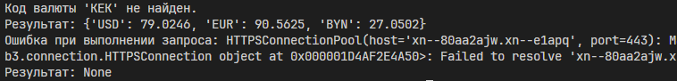
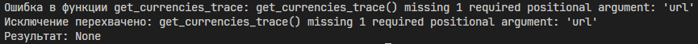
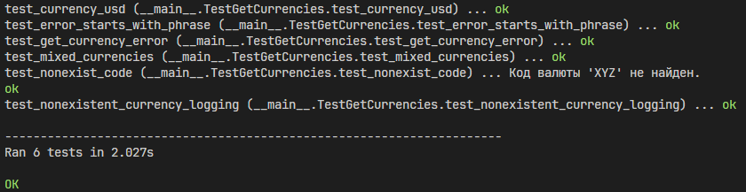

# Лабораторная работа 6. Курсы валют
## Постановка задачи
Написать функцию get_currencies(currency_codes, url), которая обращается к API по url (по умолчанию - https://www.cbr-xml-daily.ru/daily_json.js) и возвращает словарь курсов валют для валют из списка currency_codes.

В возвращаемом словаре ключи - символьные коды валют, а значения - их курсы.

В случае ошибки запроса функция должна вернуть None.

Для обращения к API использовать функцию get модуля requests.

Для установки requests можно использовать команду:
```bash
pip install requests
```
#### Итерация 1
Предусмотреть в функции логирование ошибок с использованием стандартного потока вывода (sys.stdout).

Функция должна обрабатывать следующие исключения:

- в ответе не содержатся курсы валют;
- в словаре курсов валют нет валюты из списка currency_codes;
- ошибка выполнения запроса к API.
#### Итерация 2
Вынести логирование ошибок из функции get_currencies(currency_codes, url) в декоратор.
#### Итерация 3
Оформить логирование ошибок с использованием модуля logging.
#### Тестирование должно содержать:
- проверку ключей и значений возвращаемого словаря;
- проверку обработки исключений;
- проверку записей логов в поток вывода.
## Код программы
### Чистая функция get_currencies
```python
import requests

def get_currencies(currency_codes, url="https://www.cbr-xml-daily.ru/daily_json.js"):
    try:
        response = requests.get(url)
        response.raise_for_status()
        
        data = response.json()
   
        if 'Valute' not in data:
            return None
        
        valutes = data['Valute']
        result = {}
        
        for code in currency_codes:
            if code in valutes:
                result[code] = valutes[code]['Value']
        
        return result
        
    except requests.exceptions.RequestException:
        return None
```
### Итерация 1. Стандартный поток вывода
```python
import requests
import sys

def get_currencies(currency_codes: list, url:str = "https://www.cbr-xml-daily.ru/daily_json.js", handle=sys.stdout)->dict:

    try:
        response = requests.get(url)
        response.raise_for_status() 
        data = response.json()
        currencies = {}

        if "Valute" in data:
            for code in currency_codes:
                if code in data["Valute"]:
                    currencies[code] = data["Valute"][code]["Value"]
                else:
                    handle.write(f"Код валюты '{code}' не найден.\n")
        return currencies

    except Exception as e:
        handle.write(f"Ошибка при выполнении запроса: {e}\n")
        return None
```
### Итерация 2. Декоратор
```python
import sys
from functools import wraps
from currencies import get_currencies

def trace(handle=sys.stdout):
    def decorator(func):
        @wraps(func)
        def wrapper(*args, **kwargs):
            try:
                return func(*args, **kwargs)
            except Exception as e:
                handle.write(f"Ошибка в функции {func.__name__}: {e}\n")
                raise
        return wrapper
    return decorator

from currencies import get_currencies

@trace(handle=sys.stdout)
def get_currencies_trace(currency_codes, url):
    return get_currencies(currency_codes, url)
```
### Итерация 3. Модуль logging
```python
import logging
from currencies import get_currencies

logging.basicConfig(
    filename="currencies.log",
    level=logging.DEBUG,
    format="%(levelname)s: %(message)s"
)

logger = logging.getLogger("currency_api")

def get_currencies_logging(currency_codes, url="https://www.cbr-xml-daily.ru/daily_json.js"):
    logger.info(f"Codes: {currency_codes}")
    
    try:
        result = get_currencies(currency_codes, url)
        
        if result is None:
            logger.error("API returned invalid data or a request error occurred")
        else:
            not_found = [code for code in currency_codes if code not in result]
            for code in not_found:
                logger.warning(f"Code '{code}' was not found.")
            
            logger.info(f"Number of exchange rates received: {len(result)}")
        
        return result
        
    except Exception as e:
        logger.error(f"Error while executing request: {e}")
        return None
```
## Результат
### Итерация 1

### Итерация 2

### Итерация 3

## Пояснение к коду
### Чистая функция get_currencies
Аргументы функции:
- currency_codes - коды валют
- url - URL-адрес API Центробанка РФ

Весь код обернут в конструкцию try и except для обработки ошибок. При любой возникшей ошибки возвращает значение None.

Сначала в try идет get-запрос к API и проверяется его статус (если 200-299, то продолжает работу, если 400-599, то прекращает). В переменную data парсируется JSON в словарь.

Если ключ Valute не в data, то возвращается None. 

В переменную valutes записываются все доступные валюты. Потом проходит по каждому запрошенному коду валюты из currency_codes, если валюта найдена, то она добавляется в result. В конце возвращается result. 
### Итерация 1
Аргументы функции:
- currency_codes - список кодов валют
- url - URL-адрес API Центробанка РФ
- handle=sys.stdout - поток для вывода логов

Функция возвращает словарь. В итерации 1 также используется конструкция try и except. В случае ошибки логирует сообщение в handle и возвращает значение None.

Функция в итерации 1 схожа с чистой функцией get_currencies, только в случае если код валюты не был найден, то логируется сообщение в handle, а если найден, то он добавляется в результат. В конце возвращается словарь currencies.
### Итерация 2
Импортируем чистую функцию get_currencies, sys для доступа к sys.stdout и декоратор wraps из functools.

В функцию trace принимается параметр handle и в конце возвращается decorator. В функцию decorator принимается функция для обертывания и возвращается обернутая функция wrapper. В функции wrapper ловятся все исключения и логируются в handle и также выполняется оригинальная функция.
### Итерация 3
Импортируем модуль logging и чистую функцию get_currencies.

Настраиваем конфиг для логирования, а именно файл, в который будут записываться логи, какие сообщения будут записываться и их формат.

Если result будет None, то в логи запишется сообщение ERROR, что API недоступно или данные неверны. Для каждой ненайденной валюты будет выведено сообщение WARNING. Для успешного выполнения будет выведено сообщение INFO с количеством полученных валют. Для всех исключений будет логироваться сообщение ERROR с описанием исключения.
## Тестирование
```python
import unittest
import io
from iteration1 import get_currencies

MAX_R_VALUE = 1000

class TestGetCurrencies(unittest.TestCase):

    def test_currency_usd(self):
        currency_list = ['USD']
        currency_data = get_currencies(currency_list)

        self.assertIn(currency_list[0], currency_data)
        self.assertIsInstance(currency_data['USD'], float)
        self.assertGreaterEqual(currency_data['USD'], 0)
        self.assertLessEqual(currency_data['USD'], MAX_R_VALUE)

    def test_nonexist_code(self):
        result = get_currencies(['XYZ'])
        self.assertNotIn('XYZ', result)
        self.assertEqual(result, {})

    def test_get_currency_error(self):
        error_phrase_regex = "Ошибка при выполнении запроса"
        currency_list = ['USD']
        captured_output = io.StringIO()
        
        result = get_currencies(currency_list, url="https://", handle=captured_output)
        
        output = captured_output.getvalue()
        self.assertIn(error_phrase_regex, output)
        self.assertIsNone(result)

    def test_error_starts_with_phrase(self):
        error_phrase = "Ошибка при выполнении запроса"
        currency_list = ['USD']
        captured_output = io.StringIO()
        
        result = get_currencies(currency_list, url="https://", handle=captured_output)
        
        output = captured_output.getvalue()
        self.assertTrue(output.startswith(error_phrase))

    def test_nonexistent_currency_logging(self):
        currency_list = ['USD', 'KEK']
        captured_output = io.StringIO()
        
        result = get_currencies(currency_list, handle=captured_output)
        
        output = captured_output.getvalue()
        self.assertIn("Код валюты 'KEK' не найден", output)
        self.assertIn('USD', result)
        self.assertNotIn('KEK', result)
        self.assertEqual(len(result), 1) 

    def test_mixed_currencies(self):
        currency_list = ['USD', 'EUR', 'KEK']
        captured_output = io.StringIO()
        
        result = get_currencies(currency_list, handle=captured_output)
        
        output = captured_output.getvalue()
        self.assertIn("Код валюты 'KEK' не найден", output)
        self.assertIn('USD', result)
        self.assertIn('EUR', result)
        self.assertNotIn('KEK', result)
        self.assertEqual(len(result), 2)

unittest.main(verbosity=2)
```
## Результат

### Ефимов Сергей Робертович, 2 курс, ИВТ-2