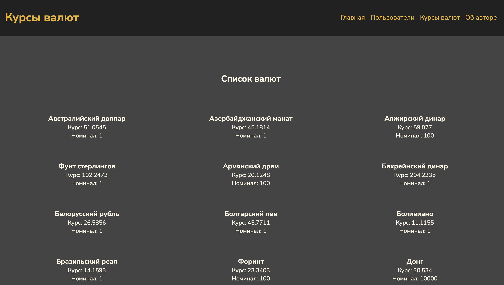

# Лабораторная работа 7. Клиент-серверное приложение
В разработке...
## Цель работы

1. Создать простое клиент-серверное приложение на Python без серверных фреймворков.

2. Освоить работу с HTTPServer и маршрутизацию запросов.

3. Применять шаблонизатор Jinja2 для отображения данных.

4. Реализовать модели предметой области (User, Currency, UserCurrency, App, Author) с геттерами и сеттерами.

5. Структурировать код в соответствии с архитектурой MVC.

6. Получать данные о курсах валют через функцию get_currencies и отображать их пользователям.

7. Реализовать функциональность подписки пользователей на валюты и отображение динамики их изменения.

8. Научиться создавать тесты для моделей и серверной логики.

## Описание моделей
### Author
- name - имя автора
- group - учебная группа

Используется для отображения информации об авторе на главной странице.

### App
- name - название приложения
- version - версия приложения 
- author - объект Author

Описывает само приложение.

### User
- id - уникальный идентификатор
- name - имя пользователя

Описывает пользователя системы.

### Currency
- id - уникальный идентификатор
- num_code - цифровой код
- char_code - символьный код
- name - название валюты
- value - курс валюты
- nominnal - номинал

Описывает валюту и её текущий курс.

### UserCurrency
- id - уникальный идентификатор
- user_id - внешний ключ к User
- currency_id - внешний ключ к Currency

Реализует связь между пользователями и валютами.

## Архитектура проекта
```text
myapp/
├── models/
│ ├── __init__.py
│ ├── author.py
│ ├── app.py
│ ├── user.py
│ ├── currency.py
│ └── user_currency.py
├── templates/
│ ├── 404.html
│ ├── author.html
│ └── currencies.html
│ └── index.html
│ └── user.html
│ └── users.html
├── static/
│ └── css, js, images
├── myapp.py
└── utils/
 └── currencies_api.py
```

## Скриншоты страниц
### Главная страница


### Пользователи


### Курсы валют


### Ефимов Сергей Робертович, 2 курс, ИВТ-2


