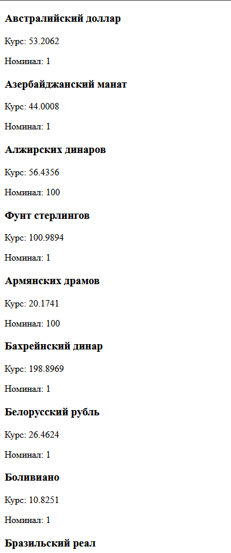
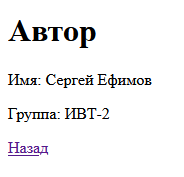
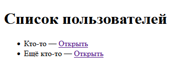
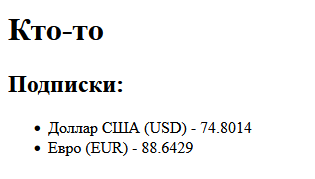
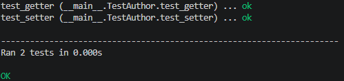
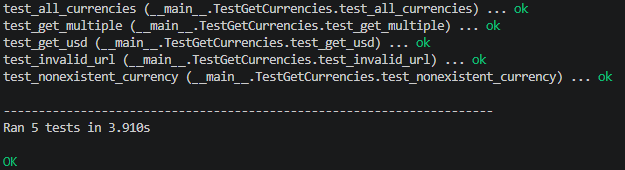
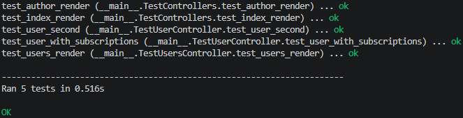

# Лабораторная работа 7.
## Цель работы
1. Создать простое клиент-серверное приложение на Python без серверных фреймворков.
2. Освоить работу с HTTPServer и маршрутизацию запросов.
3. Применять шаблонизатор Jinja2 для отображения данных.
4. Реализовать модели предметной области (User, Currency, UserCurrency, App, Author) с геттерами и сеттерами.
5. Структурировать код в соответствии с архитектурой MVC.
6. Получать данные о курсах валют через функцию get_currencies и отображать их пользователям.
7. Реализовать функциональность подписки пользователей на валюты и отображение динамики их изменения.
8. Научиться создавать тесты для моделей и серверной логики.
## Описание предметной области
1. Author
    - name - имя автора
    - group - учебная группа

2. App
    - name - название приложения
    - version - версия приложения
    - author - объект Author

3. User
    - id - уникальный идентификатор
    - name - имя пользователя

4. Currency
    - id - уникальный идентификатор
    - num_code - цифровой код
    - char_code - символьный код
    - name - название валюты
    - value - курс
    - nominal - номинал

5. UserCurrency
    - id - уникальный идентификатор
    - user_id - внешний ключ к User
    - currency_id - внешний ключ к Currency
    - Реализует связь "много ко многим" между пользователями и валютами

## Страницы
### Главная страница

### Страница валют

### Страница автора

### Страница пользователей

### Страница конкретного пользователя


## Тестирование
### Тесирование одной из моделей
#### Код
```python
import unittest
import sys
import os

sys.path.insert(0, os.path.abspath(os.path.join(os.path.dirname(__file__), '..')))

from models.author import Author

class TestAuthor(unittest.TestCase):
    def test_getter(self):
        author = Author('Данил Колбасенко', 'Стандофф 2')
        self.assertEqual(author.name, 'Данил Колбасенко')
        self.assertEqual(author.group, 'Стандофф 2')
        
    def test_setter(self):
        author = Author('Артур', 'Группа 1')
        author.name = 'Привет, Артур'
        author.group = 'Hi!'
        self.assertEqual(author.name, 'Привет, Артур')
        self.assertEqual(author.group, 'Hi!')
        
unittest.main(verbosity=2)
```
#### Результат


### Тестирование currencies_api
#### Код
```python
import unittest
import sys
import os

sys.path.append(os.path.abspath(os.path.join(os.path.dirname(__file__), '..')))

from utils.currencies_api import get_currencies


MAX_REASONABLE_RATE = 1000 


class TestGetCurrencies(unittest.TestCase):

    def test_get_usd(self):
        result = get_currencies(['USD'])

        self.assertIsNotNone(result)
        self.assertIn('USD', result)

        usd = result['USD']

        self.assertIsInstance(usd, dict)
        self.assertIn('value', usd)

        self.assertIsInstance(usd['value'], (int, float))
        self.assertGreater(usd['value'], 0)
        self.assertLess(usd['value'], MAX_REASONABLE_RATE)

    def test_get_multiple(self):
        result = get_currencies(['USD', 'EUR'])

        self.assertIn('USD', result)
        self.assertIn('EUR', result)
        self.assertEqual(len(result), 2)

    def test_nonexistent_currency(self):
        result = get_currencies(['XYZ'])

        self.assertIsInstance(result, dict)
        self.assertEqual(result, {})

    def test_all_currencies(self):
        result = get_currencies()

        self.assertIsInstance(result, dict)
        self.assertGreater(len(result), 10)

    def test_invalid_url(self):
        result = get_currencies(url="https://invalid-url")

        self.assertIsNone(result)


unittest.main(verbosity=2)
```
#### Результат


### Тестирование контроллеров
#### Код
```python
import unittest
import os
import sys

sys.path.append(os.path.abspath(os.path.join(os.path.dirname(__file__), '..')))

from controllers.currenciesController import currencies
from controllers.userController import users, user
from controllers.authorController import index, author
from models.author import Author
from models.app import App


class TestUsersController(unittest.TestCase):

    def test_users_render(self):
        html = users()

        self.assertIsInstance(html, str)

        self.assertIn("Кто-то", html)
        self.assertIn("Ещё кто-то", html)


class TestUserController(unittest.TestCase):

    def test_user_with_subscriptions(self):
        html = user(1)

        self.assertIsInstance(html, str)

        self.assertIn("Кто-то", html)

        self.assertTrue(
            ("USD" in html) or ("EUR" in html)
        )

    def test_user_second(self):
        html = user(2)

        self.assertIsInstance(html, str)

        self.assertIn("Ещё кто-то", html)

        self.assertTrue(
            ("GBP" in html) or ("JPY" in html)
        )

class TestControllers(unittest.TestCase):

    def setUp(self):
        self.author = Author("Sergei Efimov", "IVT-2")
        self.app = App("Top4ik", "1.3.3.7", self.author)

    def test_index_render(self):
        html = index(self.author, self.app)

        self.assertIsInstance(html, str)

        self.assertIn("Sergei Efimov", html)
        self.assertIn("IVT-2", html)
        self.assertIn("Top4ik", html)

        self.assertIn("Главная", html)
        self.assertIn("/currencies", html)
        self.assertIn("/users", html)

    def test_author_render(self):
        html = author(self.author)

        self.assertIsInstance(html, str)

        self.assertIn("Sergei Efimov", html)
        self.assertIn("IVT-2", html)

unittest.main(verbosity=2)
```
#### Результат
