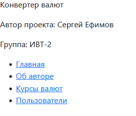
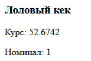
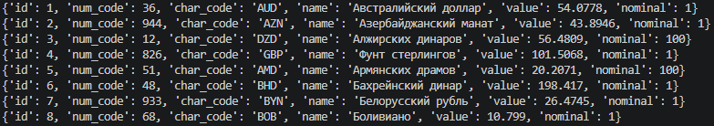
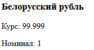
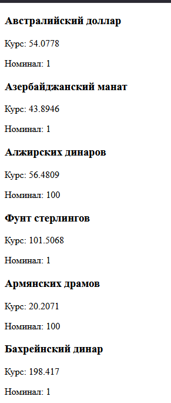
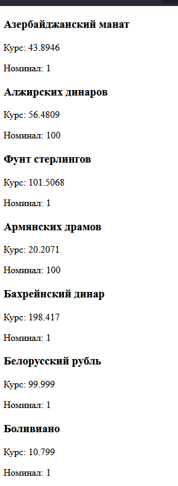

# Лабораторная работа 8
## Цель работы
1. Реализовать CRUD (Create, Read, Update, Delete) для сущностей бизнес-логики приложения.
2. Освоить работу с SQLite в памяти (:memory:) через модуль sqlite3.
3. Понять принципы первичных и внешних ключей и их роль в связях между таблицами.
4. Выделить контроллеры для работы с БД и для рендеринга страниц в отдельные модули.
5. Использовать архитектуру MVC и соблюдать разделение ответственности.
6. Отображать пользователям таблицу с валютами, на которые они подписаны.
7. Реализовать полноценный роутер, который обрабатывает GET-запросы и выполняет сохранение/обновление данных и рендеринг страниц.
8. Научиться тестировать функционал на примере сущностей currency и user с использованием unittest.mock.

## Изменения по сравнению с ЛР 7
### Новые файлы
- controllers/databaseController.py - SQLite база в памяти, содержит 3 таблицы и CRUD-методы
- controllers/pages.py - весь рендеринг Jinja2 в одном месте
- tests/test_currencies_ctrl.py - тесты для CurrenciesController
- tests/test_users_ctrl.py - тесты для userController
### Измененные файлы
- controllers/currenciesController.py - стал классом и работает с БД
- controllers/userController.py - стал классом и работает с БД
- myapp.py - новые импорты, новые маршруты для обновления и удаления валют
### Удаленные файлы
- controllers/authorController.py - вся логика теперь находится в controllers/pages.py

## Страницы
### Главная страница

### Страница автора

### Страница валют

### Страница пользователей

### Страница одного пользователя

## CRUD маршруты
### Добавление новой валюты
#### Маршрут
http://localhost:8000/currencies/create?num_code=666&char_code=LOL&name=Лоловый%20кек&value=52.6742&nominal=1
#### Результат

### Чтение всех валют
#### Маршрут: 
http://localhost:8000/currencies/show
#### Результат (часть)

### Обновление курса валюты
#### Маршрут
http://localhost:8000/currencies/update?BYN=99.999
Обновить курс белорусского рубля на 99.999
#### Результат

### Удаление валюты
#### Маршрут
http://localhost:8000/currencies/delete?id=1
Удалить первую валюту из списка (Австралийский доллар)
#### Результат до

#### Результат после
