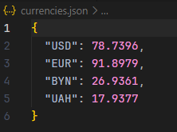
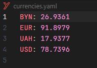
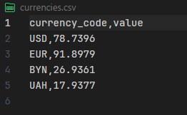

# Лабораторная работа 2. Шаблон "Декоратор"
## Постановка задачи
Написать фрагмент программы, которая использует шаблон (паттерн) «Декоратор». В качестве бизнес-логики реализовать базовый способ получения курсов валют в формате json (использовать материалы ЛР 6 из 3 семестра) с помощью API Центробанка. И реализовать конкретные декораторы, которые будут позволять преобразовывать результаты базового декоратора в Yaml-формат (библиотека PyYaml, нужно установить) и в CSV-формат (библиотека) csv (встроенная библиотека). Классы декораторы должны иметь помимо основного метода, который возвращает объект в соответствующем формате, метод, который сохраняет данные в файл соответствующего типа.

Пожалуйста, реализуйте наиболее правильным образом интерфейс (с использованием ABC и @abstractmethod).

## Код программы
```python
from abc import ABC, abstractmethod
import json
import yaml
import csv

import requests


def get_currencies(currency_codes, url="https://www.cbr-xml-daily.ru/daily_json.js"):
    try:
        response = requests.get(url)
        response.raise_for_status()

        data = response.json()

        if 'Valute' not in data:
            return None

        valutes = data['Valute']
        result = {}

        for code in currency_codes:
            if code in valutes:
                result[code] = valutes[code]['Value']

        return result

    except requests.exceptions.RequestException:
        return None


class Component(ABC):
    @abstractmethod
    def operation(self):
        pass

    @abstractmethod
    def save(self, filename: str):
        pass


class ConcreteComponent(Component):
    def __init__(self, codes):
        self.codes = codes

    def operation(self) -> str:
        return json.dumps(get_currencies(self.codes), indent=0)

    def save(self, filename: str):
        with open(filename, 'w', encoding='utf-8') as f:
            json.dump(json.loads(self.operation()), f, indent=0)


class Decorator(Component):
    def __init__(self, component: Component):
        self._component = component

    def operation(self):
        return self._component.operation()

    @abstractmethod
    def save(self, filename: str):
        pass


class JsonDecorator(Decorator):
    def operation(self) -> str:
        return self._component.operation()

    def save(self, filename: str):
        data = json.loads(self.operation())

        with open(filename, "w", encoding="utf-8") as f:
            json.dump(data, f, indent=0)

class YamlDecorator(Decorator):
    def operation(self) -> str:
        data = json.loads(self._component.operation())
        return yaml.dump(data, allow_unicode=True)

    def save(self, filename: str):
        data = json.loads(self._component.operation())
        with open(filename, "w", encoding="utf-8") as f:
            yaml.dump(data, f, allow_unicode=True)

class CsvDecorator(Decorator):
    def operation(self) -> str:
        data = json.loads(self._component.operation())

        lines = ["Currency,Value"]
        for code, value in data.items():
            lines.append(f"{code},{value}")

        return "\n".join(lines)

    def save(self, filename: str):
        data = json.loads(self._component.operation())
        with open(filename, "w", newline="", encoding="utf-8") as f:
            writer = csv.writer(f)
            writer.writerow(["Currency", "Value"])
            
            for code, value in data.items():
                writer.writerow([code, value])


if __name__ == "__main__":
    codes = ['USD', 'EUR', 'BYN', 'UAH']
    
    source = ConcreteComponent(codes)
    
    json_result = JsonDecorator(source)
    json_result.save("currencies.json")

    yaml_result = YamlDecorator(source)
    yaml_result.save("currencies.yaml")

    csv_result = CsvDecorator(source)
    csv_result.save("currencies.csv")
```
## Результат
### currencies.json

### currencies.yaml

### currencies.csv


## Тестирование
```python
import unittest
import json
import yaml
from main import Component, ConcreteComponent, JsonDecorator, YamlDecorator, CsvDecorator


class MockComponent(Component):
    def operation(self) -> str:
        data = {"USD": 666.0, "EUR": 1337.0}
        return json.dumps(data)

    def save(self, filename: str):
        pass

class TestDecorators(unittest.TestCase):

    def setUp(self):
        self.source = MockComponent()
        
    def test_operation(self):
        source = ConcreteComponent(codes=['USD'])
        result = source.operation()
        self.assertIsInstance(result, str)
        
        data = json.loads(result)
        self.assertIsNotNone(data)

    def test_json_decorator(self):
        decorator = JsonDecorator(self.source)
        result = decorator.operation()
        self.assertIsInstance(result, str)
        
        data = json.loads(result)
        self.assertEqual(data["USD"], 666.0)
        self.assertIn("EUR", data)

    def test_yaml_decorator(self):
        decorator = YamlDecorator(self.source)
        result = decorator.operation()
        
        data = yaml.safe_load(result)
        self.assertEqual(data["USD"], 666.0)
        self.assertIn("EUR", result)

    def test_csv_decorator(self):
        decorator = CsvDecorator(self.source)
        result = decorator.operation()
        
        self.assertIn("Currency,Value", result)
        self.assertIn("USD,666.0", result)


if __name__ == "__main__":
    unittest.main(verbosity=2)
```

### Ефимов Сергей Робертович, 2 курс, ИВТ-2