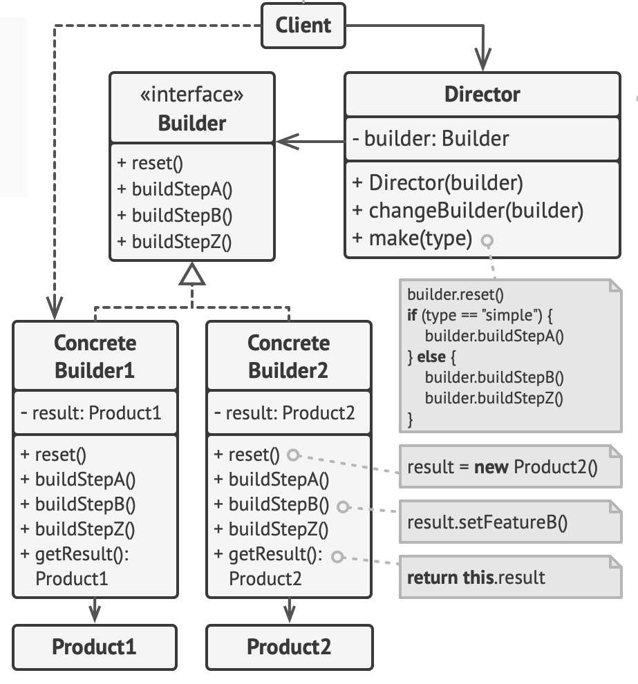

# Лабораторная работа 4. Паттерн "Строитель"
## Постановка задачи
Разработать систему для составления отчетов, используя паттерн строитель (builder).

## Суть паттерна
Строитель — это порождающий паттерн проектирования, который позволяет создавать сложные объекты пошагово. Строитель даёт возможность использовать один и тот же код строительства для получения разных представлений объектов.

## Схема паттерна


## Код программы
```python
from abc import ABC, abstractmethod
from docx import Document
from docx.shared import Pt


class ReportBuilder(ABC):

    @abstractmethod
    def add_header(self, data):
        pass

    @abstractmethod
    def add_body(self, data):
        pass

    @abstractmethod
    def add_conclusion(self, data):
        pass

    @abstractmethod
    def save(self, filename):
        pass


class DocxReportBuilder(ReportBuilder):

    def __init__(self):
        self.document = Document()

    def add_header(self, data):
        self.document.add_heading(data["title"], 0)

        p = self.document.add_paragraph()
        run = p.add_run(f"Тема работы: {data['theme']}")
        run.font.size = Pt(14)

        p = self.document.add_paragraph()
        run = p.add_run(f"Цель работы: {data['goal']}")
        run.font.size = Pt(14)

    def add_body(self, data):
        for block in data["body"]:

            if block["type"] == "text":
                p = self.document.add_paragraph()
                run = p.add_run(block["content"])
                run.font.size = Pt(14)

            elif block["type"] == "heading":
                self.document.add_heading(block["content"], level=1)

            elif block["type"] == "table":
                rows = len(block["rows"]) + 1
                cols = len(block["headers"])

                table = self.document.add_table(rows=rows, cols=cols)

                # Заголовки
                for col, header in enumerate(block["headers"]):
                    table.rows[0].cells[col].text = header

                # Данные
                for i, row in enumerate(block["rows"], start=1):
                    for j, cell in enumerate(row):
                        table.rows[i].cells[j].text = str(cell)

    def add_conclusion(self, data):
        self.document.add_heading("Вывод", level=1)

        p = self.document.add_paragraph()
        run = p.add_run(data["conclusion"])
        run.font.size = Pt(14)

    def save(self, filename):
        self.document.save(filename)


class HTMLReportBuilder(ReportBuilder):

    def __init__(self):
        self.parts = []

    def add_header(self, data):
        self.parts.append(f"<h1>{data['title']}</h1>")
        self.parts.append(f"<h2>Тема работы: {data['theme']}</h2>")
        self.parts.append(f"<p><b>Цель работы:</b> {data['goal']}</p>")

    def add_body(self, data):
        for block in data["body"]:

            if block["type"] == "text":
                self.parts.append(f"<p>{block['content']}</p>")

            elif block["type"] == "heading":
                self.parts.append(f"<h2>{block['content']}</h2>")

            elif block["type"] == "table":
                table_html = "<table border='1'>"

                # Заголовки
                table_html += "<tr>"
                for header in block["headers"]:
                    table_html += f"<th>{header}</th>"
                table_html += "</tr>"

                # Данные
                for row in block["rows"]:
                    table_html += "<tr>"
                    for cell in row:
                        table_html += f"<td>{cell}</td>"
                    table_html += "</tr>"

                table_html += "</table>"
                self.parts.append(table_html)

    def add_conclusion(self, data):
        self.parts.append("<h2>Вывод</h2>")
        self.parts.append(f"<p>{data['conclusion']}</p>")

    def save(self, filename):
        html = "<html><body>\n" + "\n".join(self.parts) + "\n</body></html>"
        with open(filename, "w", encoding="utf-8") as f:
            f.write(html)


class Director:

    def __init__(self, builder: ReportBuilder):
        self.builder = builder

    def build_report(self, data):
        self.builder.add_header(data)
        self.builder.add_body(data)
        self.builder.add_conclusion(data)


report_data = {
    "title": "Лабораторная работа",
    "theme": "Доверительный интервал",
    "goal": "Изучить методы построения доверительных интервалов для среднего значения, доли и дисперсии генеральной совокупности",

    "body": [

        {"type": "text", "content": "Задание 1."},
        {"type": "text", "content": "Постановка задачи: Азимут оси ВПП измерен в 4 приема. Результаты измерений представлены в таблице. Требуется оценить точность результата измерения."},

        {
            "type": "table",
            "headers": ["i", "xi", "xi - x", "(xi - x)^2"],
            "rows": [
                ["1", "25° 17' 30''", "-15''", "225"],
                ["2", "25° 17' 45''", "0''", "0"],
                ["3", "25° 18' 15''", "30''", "900"],
                ["4", "25° 17' 30''", "-15''", "225"]
            ]
        },

        {"type": "text", "content": "Решение:"},
        {"type": "text", "content": "Начальные данные: n = 4, степень свободы = 3, доверительная вероятность = 0,95."},
        {"type": "text", "content": "Среднее значение x̄ = 25° 17' 45''."},
        {"type": "text", "content": "Дисперсия S2 = 450, стандартное отклонение S = 21,21."},
        {"type": "text", "content": "Среднеквадратическое отклонение центра распределения = 10,61."},
        {"type": "text", "content": "Коэффициент Стьюдента t = 3,18."},
        {"type": "text", "content": "Предельная погрешность ≈ 34."},
        {"type": "text", "content": "Доверительный интервал: от 25° 17' 11'' до 25° 18' 19''."},

        {"type": "text", "content": "Задание 2."},
        {"type": "text", "content": "Постановка задачи: Проверен расход энергии в 10 квартирах. Данные: 125, 78, 102, 140, 90, 45, 50, 125, 115, 112."},
        {"type": "text", "content": "Определить доверительный интервал с надежностью 0,95."},

        {"type": "text", "content": "Решение:"},
        {"type": "text", "content": "N = 70, n = 10, γ = 0,95."},
        {"type": "text", "content": "t = 2,26."},
        {"type": "text", "content": "Среднее значение x̄ = 98,2, стандартное отклонение S = 32,145."},
        {"type": "text", "content": "Предельная погрешность Δ = 21,27."},
        {"type": "text", "content": "Доверительный интервал: (76,93; 119,47)."},

        {"type": "text", "content": "Задание 3."},
        {"type": "text", "content": "Постановка задачи: Определить объем выборки при N = 1000 и надежности 0,95."},

        {"type": "text", "content": "Решение:"},
        {"type": "text", "content": "t = 1,96."},
        {"type": "text", "content": "Повторная выборка: n = 384."},
        {"type": "text", "content": "Бесповторная выборка: n = 277."},

        {"type": "text", "content": "Задание 4."},
        {"type": "text", "content": "Постановка задачи: В партии 5000 изделий, проверено 400, из них 300 высшего сорта."},

        {"type": "text", "content": "Решение:"},
        {"type": "text", "content": "t = 1,96, W = 0,75."},
        {"type": "text", "content": "Интервал (повторная): (0,7076; 0,7924)."},
        {"type": "text", "content": "Интервал (бесповторная): (0,7093; 0,7907)."},

        {"type": "text", "content": "Задание 5."},
        {"type": "text", "content": "Постановка задачи: Найти объем выборки для 10000 банок при ошибке 0,05 и надежности 0,9995."},

        {"type": "text", "content": "Решение:"},
        {"type": "text", "content": "t = 3,5, W = 0,5."},
        {"type": "text", "content": "Повторная выборка: n = 1225."},
        {"type": "text", "content": "Бесповторная выборка: n = 1091."},

        {"type": "text", "content": "Задание 6."},
        {"type": "text", "content": "Постановка задачи: Найти доверительный интервал для среднего квадратического отклонения."},

        {"type": "text", "content": "Решение:"},
        {"type": "text", "content": "Среднее значение = 0,3."},
        {"type": "text", "content": "Дисперсия S2 = 0,01158."},
        {"type": "text", "content": "Интервал для дисперсии: (0,006; 0,034)."},
        {"type": "text", "content": "Интервал для СКО: (0,077; 0,184)."},
    ],

    "conclusion": "В ходе лабораторной работы были построены доверительные интервалы для среднего значения, доли и среднего квадратического отклонения для повторной и бесповторной выборок."
}


if __name__ == "__main__":
    docx_builder = DocxReportBuilder()
    director = Director(docx_builder)
    director.build_report(report_data)
    docx_builder.save("report.docx")

    html_builder = HTMLReportBuilder()
    director = Director(html_builder)
    director.build_report(report_data)
    html_builder.save("report.html")

```

## Сопоставление кода со схемой паттерна
1. класс ReportBuilder - это строитель, в котором объявляются общие шаги для всех видов строителя.
2. классы DocxReportBuilder и HTMLReportBuilder - это конкретные строители, в которых реализуются шаги по-своему.
3. класс Director - это директор, определяющий порядок вызова шагов

## Результат работы
Результатом работы являются созданные файлы:
- report.docx
- report.html

