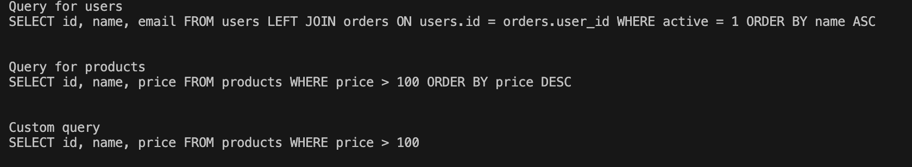

# Лабораторная работа 4. Паттерн "Строитель"
## Постановка задачи
Разработать систему для приготовления пиццы, используя паттерн строитель (builder).
## Суть паттерна
Строитель — это порождающий паттерн проектирования, который позволяет создавать сложные объекты пошагово. Строитель даёт возможность использовать один и тот же код строительства для получения разных представлений объектов.
## Код программы
```python
from abc import ABC, abstractmethod

class PizzaBuilder(ABC):

	@property
	@abstractmethod
	def pizza(self):
		pass

	@abstractmethod
	def add_dough(self):
		pass

	@abstractmethod
	def add_sauce(self):
		pass

	@abstractmethod
	def add_toppings(self):
		pass

class Pizza:
	def __init__(self):
		self.parts = []

	def add(self, part):
		self.parts.append(part)

	def show(self):
		print("Ингредиенты для пиццы:", ", ".join(self.parts))

class MargaritaBuilder(PizzaBuilder):

	def __init__(self):
		self.reset()

	def reset(self):
		self._pizza = Pizza()

	@property
	def pizza(self):
		pizza = self._pizza
		self.reset()
		return pizza
	
	def add_dough(self):
		self._pizza.add("тонкое тесто")

	def add_sauce(self):
		self._pizza.add("томатный соус")

	def add_toppings(self):
		self._pizza.add("сыр моцарелла")
		self._pizza.add("листья базилика")

class PepperoniBuilder(PizzaBuilder):

	def __init__(self):
		self.reset()

	def reset(self):
		self._pizza = Pizza()

	@property
	def pizza(self):
		pizza = self._pizza
		self.reset()
		return pizza
	
	def add_dough(self):
		self._pizza.add("толстое тесто")

	def add_sauce(self):
		self._pizza.add("томатный соус")

	def add_toppings(self):
		self._pizza.add("сыр")
		self._pizza.add("колбаса пепперони")


# повар, который спрашивает повара (на самом деле это директор)
class Cook:

	def __init__(self):
		self.builder = None

	def set_builder(self, builder):
		self.builder = builder

	def cook_minimal_pizza(self):
		self.builder.add_dough()

	def cook_full_pizza(self):
		self.builder.add_dough()
		self.builder.add_sauce()
		self.builder.add_toppings()

if __name__ == "__main__":
	cook = Cook()

	print("Пицца Маргарита")
	builder = MargaritaBuilder()
	cook.set_builder(builder)

	cook.cook_full_pizza()
	pizza = builder.pizza
	pizza.show()
	print('\n')

	print("Пицца Пепперони")
	builder = PepperoniBuilder()
	cook.set_builder(builder)

	cook.cook_full_pizza()
	pizza = builder.pizza
	pizza.show()
	print('\n')

	print("Кастомная пицца")
	builder.add_dough()
	builder.add_toppings()
	pizza = builder.pizza
	pizza.show()
```

## Результат


## Схема паттерна
